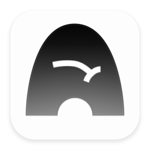

<p align="center">
  
</p>

<h1 align="center">Nook</h1>

<p align="center">
  安静的聊天式收集入口，用来快速保存想法、链接、图片、语音、文件和零散资料。
</p>

Nook 先把信息收进来，再让用户慢慢整理、摘要和归档。本仓库是 Nook 产品的 monorepo，当前主项目是 `apps/nook-ios` 下的原生 SwiftUI 原型。

本项目与 Barnes & Noble NOOK 阅读器、Nook Earn App 等公开同名产品无关联。

## 项目状态

Nook 目前处于 `Prototype / 0.1.0` 阶段。代码用于交互验证，不代表完整生产应用。

- 平台：iOS / iPadOS
- 技术栈：SwiftUI、Observation、XcodeGen
- 数据状态：当前收集内容保存在本地内存中，尚未接入账号、同步或长期存储
- AI 状态：目前是收集原型，尚未接入真实摘要、归档或搜索模型

## 仓库结构

```text
apps/nook-ios/      Nook iOS SwiftUI 原型
docs/assets/        README 与文档使用的静态资源
packages/           预留共享包目录
services/           预留服务目录
```

## 运行 Nook iOS

### 环境要求

- Xcode 26.5 或更新版本
- XcodeGen
- pnpm 11.6.0 或直接使用下方 Xcode 命令

### 生成 Xcode 工程

```bash
pnpm ios:generate
```

等价于：

```bash
xcodegen generate --spec apps/nook-ios/project.yml
```

### 打开工程

```bash
open apps/nook-ios/Nook.xcodeproj
```

### 命令行构建

```bash
pnpm ios:build
```

等价于：

```bash
xcodebuild -project apps/nook-ios/Nook.xcodeproj \
  -scheme Nook \
  -destination 'generic/platform=iOS Simulator' \
  build
```

## 源码入口

| 路径 | 用途 |
| --- | --- |
| `apps/nook-ios/project.yml` | XcodeGen 项目配置 |
| `apps/nook-ios/Nook/App/NookApp.swift` | App 入口 |
| `apps/nook-ios/Nook/Features/Collection/NookHomeView.swift` | 首页、底部输入栏、建议卡、Sheet 与 Preview |
| `apps/nook-ios/Nook/Features/Collection/NookHomeModel.swift` | 收集分类、输入状态和交互逻辑 |
| `apps/nook-ios/Nook/Models/CollectionEntry.swift` | 收集条目与来源类型 |
| `apps/nook-ios/Nook/Models/NookSuggestion.swift` | 默认快捷建议 |
| `apps/nook-ios/Nook/Design/NookTheme.swift` | 颜色、阴影和界面基础样式 |

Swift 文件和 `project.yml` 是当前事实来源。修改 target、目录结构或资源配置后，请重新运行 XcodeGen 生成工程。
